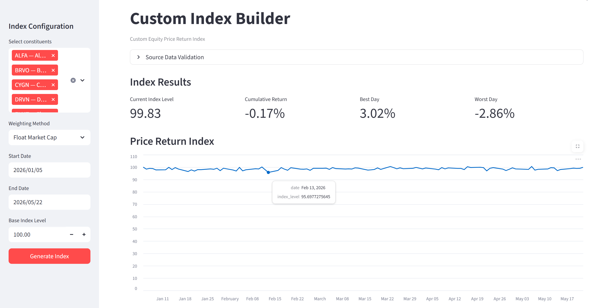

# Custom Index Builder

A Python-based web application that allows users to build and analyze a custom **equity Price Return Index** from a predefined universe of 30 dummy stocks.



This project was created as an analytical exercise for an **Index Engineering** apprenticeship application. The focus is on financial-data analysis, index calculations, validation, Python, and a simple browser-based user interface.

---

## Project Overview

The application allows a user to:

1. Select one or more stocks from a 30-stock universe.
2. Choose an index weighting method.
3. Select a date range from the available price data.
4. Generate a Price Return Index starting from a chosen base level.
5. View index performance and summary metrics.
6. Review constituent weights and latest-day contributions.
7. Review validation checks and data-quality warnings.

---

## Key Features

### Custom constituent selection

Users can select any number of stocks from the predefined 30-stock universe.

### Two weighting methods

The application supports:

- **Equal Weight**
- **Float Market Cap**

### Price Return Index

The index is calculated from daily stock returns and does **not** reinvest dividends.

### Validation

The application checks inputs and data for issues such as:

- Missing required columns
- Duplicate observations
- Missing prices
- Invalid prices
- Invalid float-market-cap values
- Unknown tickers
- Invalid date ranges
- Incomplete constituent coverage

### Analytical output

The application displays:

- Current Index Level
- Latest Daily Return
- Cumulative Return
- Best Day
- Worst Day
- Index performance chart
- Constituent weights
- Latest-day constituent contributions
- Calculation reconciliation

---

# How the Application Works

The application follows a simple workflow:

```text
User selects stocks
        ↓
Select weighting methodology
        ↓
Select date range
        ↓
Validate inputs and data
        ↓
Calculate constituent weights
        ↓
Calculate stock daily returns
        ↓
Calculate weighted index return
        ↓
Build index level
        ↓
Display results and validation
```

---

# How to Run Locally

## 1. Clone the repository

```bash
git clone https://github.com/saroj-sachin/custom-index-builder.git
cd custom-index-builder
```

## 2. Create a virtual environment

### Windows

```bash
python -m venv .venv
.venv\\Scripts\\activate
```

### macOS / Linux

```bash
python -m venv .venv
source .venv/bin/activate
```

## 3. Install dependencies

```bash
pip install -r requirements.txt
```

## 4. Run the tests

```bash
pytest -q
```

## 5. Start the Streamlit application

```bash
streamlit run app.py
```

Streamlit will provide a local URL that can be opened in a web browser.

---

# Architecture

The application separates the user interface from the analytical logic.

### `app.py`

Handles the user interface and passes the user's selections to the analytical modules.

### `data_loader.py`

Loads the universe and price data and converts dates and numeric fields into suitable data types.

### `validator.py`

Checks the structure and quality of the data and validates user selections before an index is generated.

### `weighting.py`

Calculates the selected constituent weights.

### `index_calculator.py`

Calculates stock returns, weighted index returns, index levels, summary metrics, and contribution reconciliation.

---

# Data

## Universe Data

`data/universe.csv` contains 30 dummy securities and fields including:

- ticker
- company name
- sector
- industry
- exchange
- shares outstanding
- float factor
- float market capitalization

## Price Data

`data/prices.csv` contains daily closing-prices with:

- date
- ticker
- close price

The data are **synthetic** and are intended only for this exercise.

The sample data also contain a small number of intentional data-quality issues so that validation behavior can be tested.

---

# Index Methodology

## 1. Stock Daily Return

For each security, the daily return is calculated as:

\[
r_i(t) = \frac{Close_i(t)}{Close_i(t-1)} - 1
\]

In Python, this is calculated separately for each ticker using pandas `groupby()` and `pct_change()`.

The calculation is performed on the chronological price history before applying the user's selected date range. This allows the first selected date to use its previous available price when calculating returns.


## 2. Equal Weight

If `N` securities are selected:

\[
w_i = \frac{1}{N}
\]

For example, if 5 securities are selected:

\[
w_i = 20\%
\]


## 3. Float Market-Cap Weight

The float market-cap weighting method is:

\[
w_i =
\frac{FMC_i}
{\sum_{j=1}^{N}FMC_j}
\]

where `FMC` represents float-adjusted market capitalization.

The application validates that the final weights sum to 100%.

## 4. Daily Index Return

The daily index return is calculated as:

\[
r_{index}(t) = \sum_i w_i r_i(t)
\]

The contribution of each constituent is:

\[
Contribution_i(t) = w_i r_i(t)
\]

The sum of constituent contributions should equal the calculated index return.


## 5. Index Level

The index starts from a user-selected base level, with **100** as the default.

The index level is then compounded:

\[
Level(t) =
Level(t-1)\times(1+r_{index}(t))
\]

The first displayed date is treated as the base date, so the generated index starts at the selected base level.

---

# Missing Data Handling

The application uses a strict approach for selected constituents.

If a selected security has a missing closing price during the requested calculation period:

- The issue is reported to the user.
- The index calculation is stopped.
- The application does not silently forward-fill the missing price.

This avoids creating an artificial return from an imputed price.

For duplicate `(date, ticker)` records, the calculation uses the first observation deterministically and reports the duplicate as a warning.

---

# Limitations

- Synthetic rather than live market data
- CSV-based data storage
- Fixed weights during the selected period
- No corporate-action processing
- No scheduled rebalancing
- Price Return only
- No production data-feed integration

---

# Future Improvements

- Live or production-quality market-data ingestion
- Database or data-platform integration
- Corporate-action processing
- Scheduled rebalancing
- Additional weighting methodologies
- More extensive automated tests
- Automated data-quality monitoring
- Production deployment and access controls

---